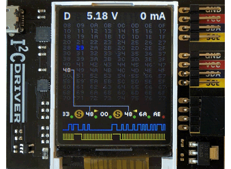

# i2cdriver
An i2c development board that works on Mac, Windows, and Linux?<br>
... and has a graphic display?<br>
... and for under $30?<br>
**Yes please!** [Buy one now!](https://amzn.to/2onQUTr)<br>
<br>
<br>



This library contains functions for:
- `i2c-bus` API
- i2cdriver device API

### Swap in place of the `i2c-bus` module
```js
// const i2c = require('i2c-bus')
// const bus_id = 1

const i2c = require('i2cdriver')['i2c-bus']
const bus_id = '/dev/tty.usbserial-DO01INSW'

const tfminiplus = require('tfmini-plus')

i2c.openPromisified(bus_id)
.then(async (bus) => {
  const tfmp = await tfminiplus.I2C(bus, 0x10)
  const distance = await tfmp.distance()
  console.log('distance:', distance)
})
.catch(console.error);
```

[i2c-bus](https://www.npmjs.com/package/i2c-bus) is a popular module for communicating with i2c devices. This module provides
a compatible/interchangable API so you can develop your i2c code on your development computer and deploy it to a device
later- with only swapping out the module reference and bus id.


## i2cdriver API
The API functions try to match the [API provided by i2cdriver](https://i2cdriver.com/i2cdriver.pdf) as close as possible.

The driver API just issues the special device commands. It does not enforce any specific (valid) command order.
You will likely want to use [i2c-bus](#i2c-bus) compatible APIs which coordinates the device calls properly.

### setspeed(100|400)
Sets the i2c bus speed (in KHz).

Supported values are:
- `100` = 100KHz
- `400` = 400KHz

### setpullups(mask)
Sets the SDA and CLK pull-up resister values. See [the i2cdriver documentation](https://i2cdriver.com/i2cdriver.pdf)
for more information.

Valid values: `0b000000` to `0b111111`

### scan()
Scans the i2c bus (0x08-0x77) for connected devices.

**Returns:** An array of address numbers of detected devices.

### reset()
Resets the i2c bus.

### start(addr, rw)
Starts a read or write session to a device on the bus.

`addr` - The i2c device address<br>
`rw` - Indicates whether to start a **read** or **write** session. Valid values:<br>
&nbsp;&nbsp;&nbsp;&nbsp;&bull; `"write"`, `0`, `false`<br>
&nbsp;&nbsp;&nbsp;&nbsp;&bull; `"read"`, 1, `true`

### read(length)
Issues a read request for `length` bytes. You should call [start(addr, 'read')](#startaddr-rw) first. The i2cdriver does not
restrict you from sending a read request out of sequence- but the result will be unknown (probably not good).

**Note:** The [i2c-bus](#i2c-bus) APIs coordinate these calls properly.

**Returns:**: A Buffer of the bytes read.

### write(buff)
Writes the Buffer to the i2c bus. You should call [start(addr, 'write')](#startaddr-rw) first. The i2cdriver does not
restrict you from sending a read request out of sequence- but the result will be unknown (probably not good).

`buff` - A Buffer of the bytes you want to send

**Note:** The [i2c-bus](#i2c-bus) APIs coordinate these calls properly.

### stop()
Concludes a read or write session.

### regrd(addr, register, size = 1)
A helper function that reads from a register on a device.

`addr` - The i2c device address<br>
`register` - (byte) The register to read from.<br>
`size` - The number of bytes to read. (e.g.: 2 for a 16 bit register)


### regwr(addr, register, value)
A helper function that writes to a register on a device.

`addr` - The i2c device address<br>
`register` - (byte) The register to write to.<br>
`value` - The byte(s) to write. Vaid values:<br>
&nbsp;&nbsp;&nbsp;&nbsp;&bull; `byte` (Number)<br>
&nbsp;&nbsp;&nbsp;&nbsp;&bull; `[byte1, byte2]` (Array of bytes) for 16bit values<br>

### status()
Gets the device status. See [the i2cdriver documentation](https://i2cdriver.com/i2cdriver.pdf)
for more information.

**Returns:**: An object with the status properties.

# License
MIT